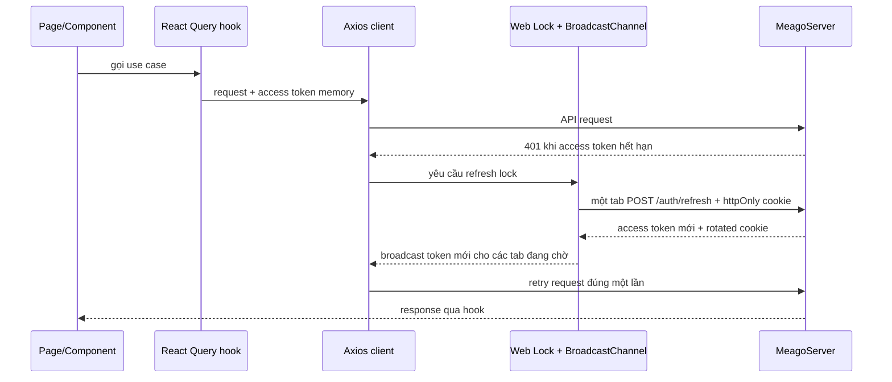

# Cấu trúc MeagoClient

Tài liệu này mô tả cấu trúc đang tồn tại trong code. Khi thêm module hoặc thay đổi luồng phụ thuộc, phải cập nhật file này trong cùng pull request.

> Bản trình bày trực quan có thể chỉnh sửa bằng diagrams.net: [frontend-architecture.drawio](../diagrams/frontend-architecture.drawio).

Quy ước sơ đồ: mũi tên liền là dependency/runtime call đang tồn tại; đường tới `@meago/core` là shared-contract dependency, không phải HTTP call. Luồng HTTP duy nhất đi từ transport tới MeagoServer. Khi thêm layer hoặc đổi hướng phụ thuộc, phải cập nhật cả file này và source draw.io.

## Bản đồ thư mục

```text
src/
├─ app/                  # Next.js App Router, layout và page
├─ components/
│  ├─ ui/               # shadcn primitives; code thuộc repository
│  ├─ shared/           # Composition dùng chung: DataTable, VirtualList, command palette
│  └─ guards/           # AuthGuard, PermissionGuard
├─ constants/           # Query-key registry và constant riêng của UI
├─ hooks/               # React Query hooks, auth/permission hooks
├─ features/            # Component/schema/hook riêng từng domain
├─ interfaces/          # Contract chỉ thuộc UI; contract dùng chung lấy từ @meago/core
├─ libs/
│  └─ axios/            # HTTP client, interceptor và refresh coordinator
├─ lib/
│  ├─ dnd/              # DnD policy, sortable composition, preset và rollback
│  └─ onboarding/       # Driver.js factory; tour riêng đặt trong feature
├─ i18n/                # Locale routing, navigation và request config
├─ providers/           # QueryClient, auth bootstrap, auth-expired listener
├─ services/            # API theo use case/domain; không chứa UI state
└─ stores/              # Zustand client state; access token chỉ nằm trong memory
```

## Hướng phụ thuộc

```mermaid
flowchart LR
    Page[App pages] --> Component[Components]
    Component --> Hook[Domain hooks]
    Hook --> Service[Domain services]
    Hook --> Store[Zustand stores]
    Service --> Http[Axios client]
    Http --> Core[@meago/core contracts]
    Service --> Core
    Http --> Api[MeagoServer /api/v1]

    Provider[App providers] --> Hook
    Provider --> Store
    Provider --> Http
```

Quy tắc: dependency chỉ đi từ lớp bên trái sang bên phải. `services` không import component; `libs` không import page; contract dùng chung không được định nghĩa lại trong Client.

## Luồng request và refresh



Web Lock chỉ tuần tự hóa callback, không tự chia sẻ kết quả. Vì vậy coordinator phải dùng cả BroadcastChannel; tab nhận kết quả không gọi thêm một rotation. Current user/permissions chỉ nằm trong React Query cache, không mirror sang Zustand. Zustand chỉ giữ access token memory và trạng thái bootstrap.

Nguồn chuẩn: [MDN Web Locks API](https://developer.mozilla.org/en-US/docs/Web/API/Web_Locks_API), [MDN Broadcast Channel API](https://developer.mozilla.org/en-US/docs/Web/API/Broadcast_Channel_API), [TanStack Query queries](https://tanstack.com/query/latest/docs/framework/react/guides/queries).

## Vị trí đặt code mới

| Thành phần | Vị trí | Không được làm |
|---|---|---|
| Page/route | `src/app` | Gọi axios trực tiếp |
| UI tái sử dụng | `src/components` | Chứa business/API orchestration |
| shadcn primitive | `src/components/ui` | Chứa logic riêng của domain |
| Feature UI | `src/features/<domain>` | Trở thành primitive dùng toàn hệ thống |
| Server-state use case | `src/hooks` | Định nghĩa lại response contract |
| API domain | `src/services` | Đọc/ghi DOM hoặc điều hướng UI |
| HTTP/auth transport | `src/libs/axios` | Chứa logic riêng của story/audio |
| Client state | `src/stores` | Persist access/refresh token |
| Shared contract | `@meago/core` | Mirror interface trong repo FE |

## Mẫu thêm domain

```text
src/services/story.service.ts
        ↓
src/hooks/use-story.ts
        ↓
src/app/... hoặc src/components/...
```

Nếu contract được cả FE và BE sử dụng, thêm vào MeagoLibrary và phát hành version mới trước khi cập nhật dependency chính xác ở hai repo.

## Quy ước shadcn/ui

- Cấu hình CLI nằm tại `components.json`; Tailwind v4 không dùng `tailwind.config`.
- Dùng `npx shadcn@latest add <component>` để thêm đúng component đang cần, không add toàn bộ registry.
- Component trong `src/components/ui` là source code thuộc dự án: được phép chỉnh theme/accessibility chung, nhưng không gắn business rule.
- Dùng `cn()` từ `@/lib/utils` để merge class có điều kiện.
- Token màu và radius nằm trong `src/app/globals.css`; feature không hard-code một theme riêng.

Primitive foundation hiện có: `Button`, `Input`, `Label`, `Card`, `Badge`, `Separator` và `Skeleton`. Trang chủ compose chúng qua `features/home`; đây là showcase kiến trúc, không phải màn hình nghiệp vụ cuối cùng.

Quyết định, trạng thái và cách dùng thư viện frontend được công bố tại [frontend-capabilities.md](../standards/frontend-capabilities.md).
